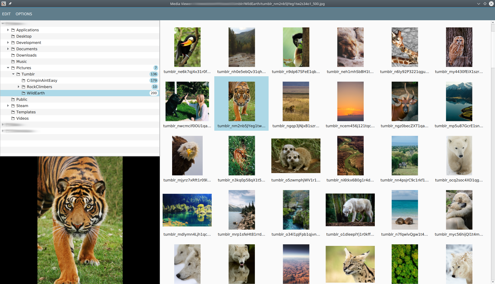

Media Viewer
============

This project is a simple multi-platform media viewer build around Qt and QML.

Installation
============

1. Clone this repository
2. Open `MediaViewer.pro` with [QtCreator](https://info.qt.io/download-qt-for-application-development)
3. Configure a kit (Qt 5.9 recommended, I'm always using the latest version)
4. Build, run and enjoy :)

FAQ
===

